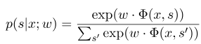
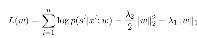
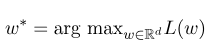
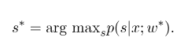
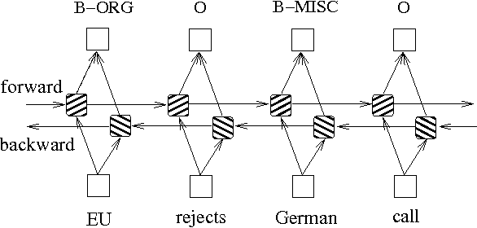

# 中文命名实体识别


## 数据集

本项目尝试使用了多种不同的模型（包括HMM，CRF，Bi-LSTM，Bi-LSTM+CRF）来解决中文命名实体识别问题，数据集用的是论文ACL 2018[Chinese NER using Lattice LSTM](https://github.com/jiesutd/LatticeLSTM)中收集的简历数据，数据的格式如下，它的每一行由一个字及其对应的标注组成，标注集采用BIOES，句子之间用一个空行隔开。

```
美	B-LOC
国	E-LOC
的	O
华	B-PER
莱	I-PER
士	E-PER

我	O
跟	O
他	O
谈	O
笑	O
风	O
生	O 
```

该数据集就位于项目目录下的`ResumeNER`文件夹里。

## 运行结果

下面是四种不同的模型以及这Ensemble这四个模型预测结果的准确率（取最好）：

|      | HMM    | CRF    | BiLSTM | BiLSTM+CRF | Ensemble |
| ---- | ------ | ------ | ------ | ---------- | -------- |
| 召回率  | 91.22% | 95.43% | 95.32% | 95.72%     | 95.65%   |
| 准确率  | 91.49% | 95.43% | 95.37% | 95.74%     | 95.69%   |
| F1分数 | 91.30% | 95.42% | 95.32% | 95.70%     | 95.64%   |

最后一列Ensemble是将这四个模型的预测结果结合起来，使用“投票表决”的方法得出最后的预测结果。

（Ensemble的三个指标均不如BiLSTM+CRF，可以认为在Ensemble过程中，是其他三个模型拖累了BiLSTM+CRF）

具体的输出可以查看`output.txt`文件。


## 快速开始

首先安装依赖项：

```
pip3 install -r requirement.txt
```

安装完毕之后，直接使用

```
python3 main.py
```

即可训练以及评估模型，评估模型将会打印出模型的精确率、召回率、F1分数值以及混淆矩阵，如果想要修改相关模型参数或者是训练参数，可以在`./models/config.py`文件中进行设置。

训练完毕之后，如果想要加载并评估模型，运行如下命令：

```shell
python3 test.py
```

下面是这些模型的简单介绍（github网页对数学公式的支持不太好，涉及公式的部分无法正常显示，[我的博客](https://zhuanlan.zhihu.com/p/61227299)  有对这些模型以及代码更加详细的介绍）：


## 隐马尔可夫模型（Hidden Markov Model，HMM）	 

隐马尔可夫模型描述由一个隐藏的马尔科夫链随机生成不可观测的状态随机序列，再由各个状态生成一个观测而产生观测随机序列的过程（李航 统计学习方法）。隐马尔可夫模型由初始状态分布，状态转移概率矩阵以及观测概率矩阵所确定。

命名实体识别本质上可以看成是一种序列标注问题，在使用HMM解决命名实体识别这种序列标注问题的时候，我们所能观测到的是字组成的序列（观测序列），观测不到的是每个字对应的标注（状态序列）。

**初始状态分布**就是每一个标注的初始化概率，**状态转移概率矩阵**就是由某一个标注转移到下一个标注的概率（就是若前一个词的标注为$tag_i$ ，则下一个词的标注为$tag_j$的概率为 $M_{ij}$），**观测概率矩阵**就是指在

某个标注下，生成某个词的概率。

HMM模型的训练过程对应隐马尔可夫模型的学习问题（李航 统计学习方法），

实际上就是根据训练数据根据最大似然的方法估计模型的三个要素，即上文提到的初始状态分布、状态转移概率矩阵以及观测概率矩阵，模型训练完毕之后，利用模型进行解码，即对给定观测序列，求它对应的状态序列，这里就是对给定的句子，求句子中的每个字对应的标注，针对这个解码问题，我们使用的是维特比（viterbi）算法。

具体的细节可以查看 `models/hmm.py`文件。


## 条件随机场（Conditional Random Field, CRF)

 HMM模型中存在两个假设，一是输出观察值之间严格独立，二是状态转移过程中当前状态只与前一状态有关。也就是说，在命名实体识别的场景下，HMM认为观测到的句子中的每个字都是相互独立的，而且当前时刻的标注只与前一时刻的标注相关。但实际上，命名实体识别往往需要更多的特征，比如词性，词的上下文等等，同时当前时刻的标注应该与前一时刻以及后一时刻的标注都相关联。由于这两个假设的存在，显然HMM模型在解决命名实体识别的问题上是存在缺陷的。

条件随机场通过引入自定义的特征函数，不仅可以表达观测之间的依赖，还可表示当前观测与前后多个状态之间的复杂依赖，可以有效克服HMM模型面临的问题。

为了建立一个条件随机场，我们首先要定义一个特征函数集，该函数集内的每个特征函数都以标注序列作为输入，提取的特征作为输出。假设该函数集为：


其中$x=(x_1, ..., x_m)$表示观测序列，$s = (s_1, ...., s_m)$表示状态序列。然后，条件随机场使用对数线性模型来计算给定观测序列下状态序列的条件概率：



其中$s^{'}$是是所有可能的状态序列，$w$是条件随机场模型的参数，可以把它看成是每个特征函数的权重。CRF模型的训练其实就是对参数$w$的估计。假设我们有$n$个已经标注好的数据$\{(x^i, s^i)\}_{i=1}^n$，

则其对数似然函数的正则化形式如下：



那么，最优参数$w^*$就是：



模型训练结束之后，对给定的观测序列$x$，它对应的最优状态序列应该是：



解码的时候与HMM类似，也可以采用维特比算法。

具体的细节可以查看 `models/crf.py`文件。


## Bi-LSTM

除了以上两种基于概率图模型的方法，LSTM也常常被用来解决序列标注问题。和HMM、CRF不同的是，LSTM是依靠神经网络超强的非线性拟合能力，在训练时将样本通过高维空间中的复杂非线性变换，学习到从样本到标注的函数，之后使用这个函数为指定的样本预测每个token的标注。下方就是使用双向LSTM（双向能够更好的捕捉序列之间的依赖关系）进行序列标注的示意图：





基于双向LSTM的序列标注模型实现可以查看`models/bilstm.py`文件。


##  Bi-LSTM+CRF

LSTM的优点是能够通过双向的设置学习到观测序列（输入的字）之间的依赖，在训练过程中，LSTM能够根据目标（比如识别实体）自动提取观测序列的特征，但是缺点是无法学习到状态序列（输出的标注）之间的关系，要知道，在命名实体识别任务中，标注之间是有一定的关系的，比如B类标注（表示某实体的开头）后面不会再接一个B类标注，所以LSTM在解决NER这类序列标注任务时，虽然可以省去很繁杂的特征工程，但是也存在无法学习到标注上下文的缺点。

相反，CRF的优点就是能对隐含状态建模，学习状态序列的特点，但它的缺点是需要手动提取序列特征。所以一般的做法是，在LSTM后面再加一层CRF，以获得两者的优点。

具体的实现请查看`models/bilstm_crf.py`


## 代码中一些需要注意的点

* HMM模型中要处理OOV(Out of vocabulary)的问题，就是测试集里面有些字是不在训练集里面的，
  这个时候通过观测概率矩阵是无法查询到OOV对应的各种状态的概率的，处理这个问题可以将OOV对应的状态的概率分布设为均匀分布。
* HMM的三个参数（即状态转移概率矩阵、观测概率矩阵以及初始状态概率矩阵）在使用监督学习方法进行估计的过程中，如果有些项从未出现，那么该项对应的位置就为0，而在使用维特比算法进行解码的时候，计算过程需要将这些值相乘，那么如果其中有为0的项，那么整条路径的概率也变成0了。此外，解码过程中多个小概率相乘很可能出现下溢的情况，为了解决这两个问题，我们给那些从未出现过的项赋予一个很小的数(如0.00000001)，同时在进行解码的时候将模型的三个参数都映射到对数空间，这样既可以避免下溢，又可以简化乘法运算。
* CRF中将训练数据以及测试数据作为模型的输入之前，都需要先用特征函数提取特征！
* Bi-LSTM+CRF模型可以参考：[Neural Architectures for Named Entity Recognition](https://arxiv.org/pdf/1603.01360.pdf)，可以重点看一下里面的损失函数的定义。代码里面关于损失函数的计算采用的是类似动态规划的方法，不是很好理解，这里推荐看一下以下这些博客：

  * [CRF Layer on the Top of BiLSTM - 5](https://createmomo.github.io/2017/11/11/CRF-Layer-on-the-Top-of-BiLSTM-5/)
  * [Bi-LSTM-CRF for Sequence Labeling PENG](https://zhuanlan.zhihu.com/p/27338210) 
  * [Pytorch Bi-LSTM + CRF 代码详解](https://blog.csdn.net/cuihuijun1hao/article/details/79405740)


## TODO

* BI-LSTM+CRF 比起Bi-LSTM效果并没有好很多，一种可能的解释是：
  - 数据集太小，不足够让模型学习到转移矩阵（后续尝试在更大的数据集上测试一下结果）
* 尝试更加复杂的模型，参考论文[Chinese NER using Lattice LSTM](https://github.com/jiesutd/LatticeLSTM)
* 更详细的评估结果：打印混淆矩阵，同时输出每种类别的召回率、准确率、F1指标，便于分析。


